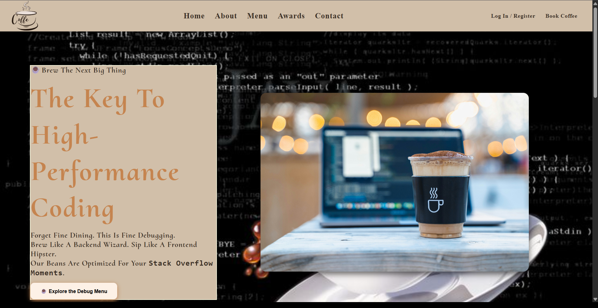
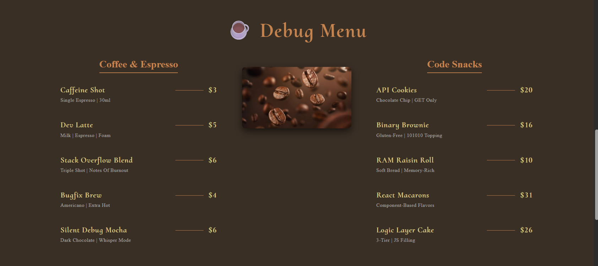

# ☕ Debug Café – Coffee for Developers

Welcome to **Debug Café**, where clean code meets clean coffee. This is a responsive, developer-centric website built for coders who run on caffeine and passion. Whether you're sipping espresso while fixing bugs or browsing snacks between compile errors, this UI serves up a menu brewed just for you.

---

## 🚀 Features

- 🔥 **Coffee & Espresso Menu** – Styled just like your code editor: clean, minimal, and functional.
- 🍪 **Code Snacks** – Because debugging is better with cookies.
- 📸 **Gallery** – Peek into our photo gallery: from coffee-fueled night shifts to daylight deployments.
- 🌐 **Responsive Design** – Looks sharp on laptops, tablets, and even your smart fridge.
- 🎨 **Custom Theme** – Coffee-inspired aesthetic with warm tones and code-friendly contrast.

---

## 📁 Tech Stack

- **React.js** – For dynamic, reusable components.
- **CSS Modules** – For scoped and themeable styles.
- **React Icons** – For that sleek, minimal UI flair.
- **JavaScript (ES6+)** – Naturally.

---

## 🖼️ Screenshots

---

## 💡 Inspiration

This project was inspired by the idea that **great software is brewed like great coffee** – with patience, precision, and strong taste. Built with love for developers who grind.

---

## 🛠️ Setup & Run

1. Clone the repo:
  
     git clone https://github.com/your-username/debug-cafe.git
    cd debug-cafe

        Install dependencies:

            npm install
         
        Start the app:

            npm start
=======
# Debug-Caf-
☕☕☕
>>>>>>> 257751192493e5006174210627df3740132d3026
